# Cryox AI MVP - 4+1 Architecture View

## **Document Overview**

This document presents the 4+1 architecture view for the Cryox AI MVP, providing a comprehensive view of the system architecture from multiple perspectives. The MVP focuses on simulating a fleet of 100+ reefer trucks with real-time temperature monitoring, anomaly detection, and energy optimization.

## **1. Logical View**

### **1.1 System Components**

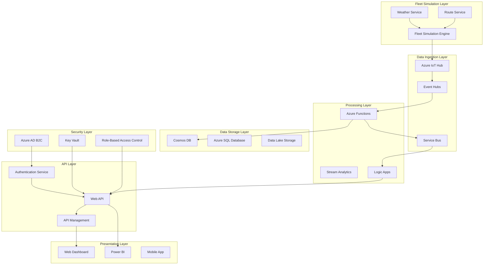

### **1.2 Core Business Logic**

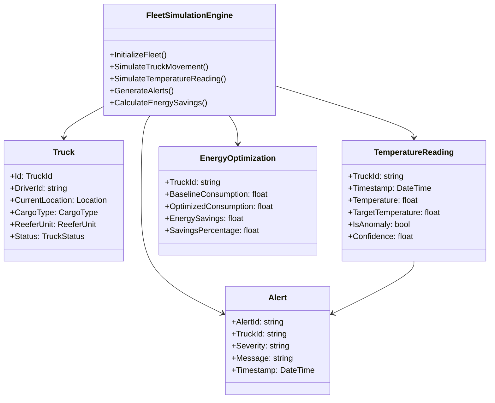

## **2. Process View**

### **2.1 Real-time Data Processing Flow**

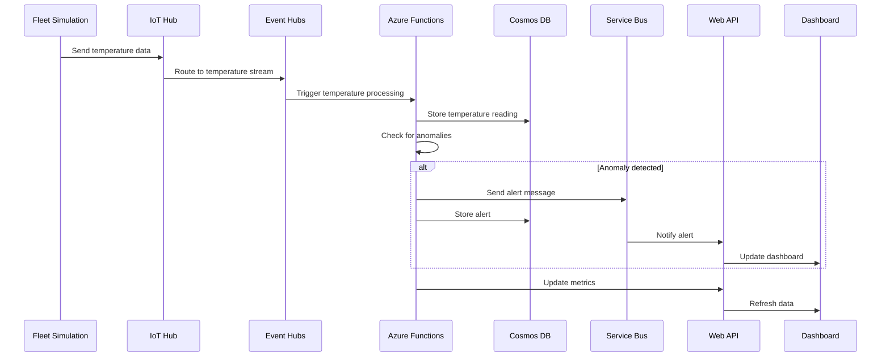

### **2.2 Authentication & Authorization Flow**

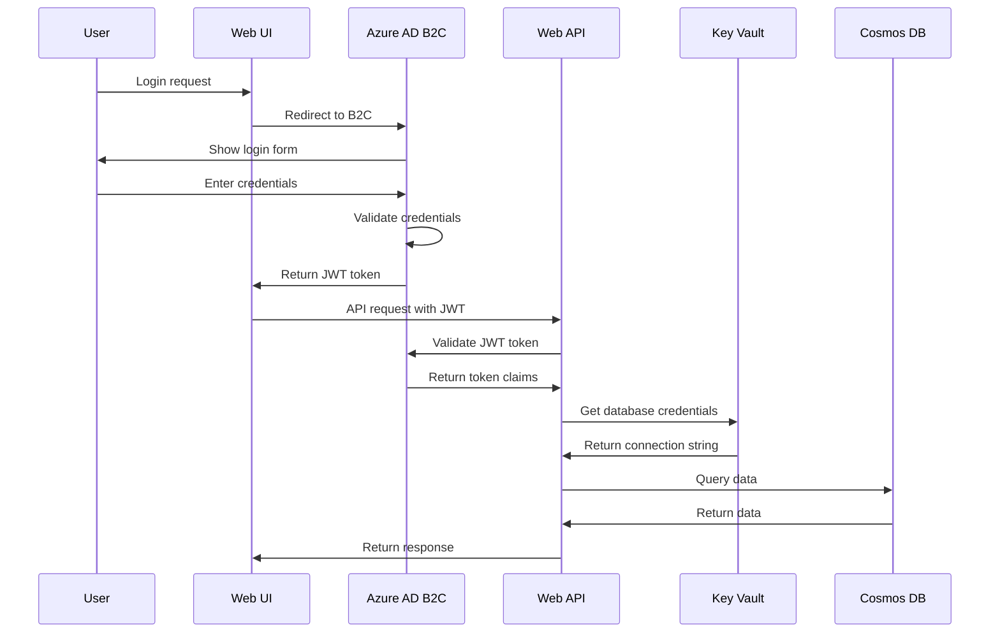

### **2.3 Fleet Simulation Process**

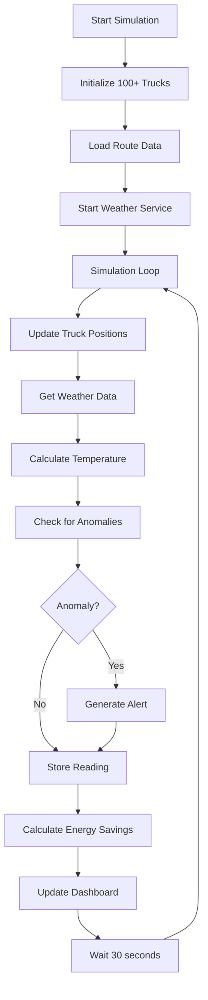

## **3. Physical View**

### **3.1 Azure Infrastructure Deployment**

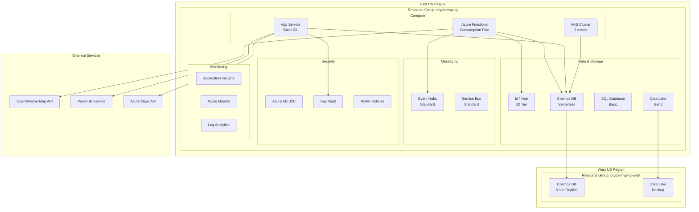

### **3.2 Network Architecture**

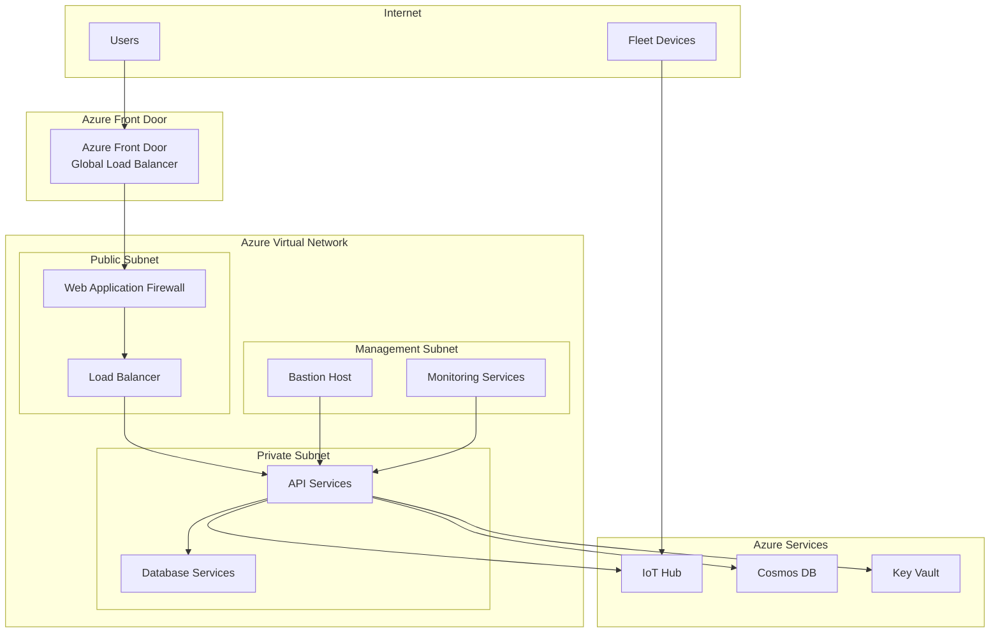

## **4. Development View**

### **4.1 Solution Structure**

```
CryoxAI.MVP/
├── src/
│   ├── CryoxAI.FleetSimulation/
│   │   ├── FleetSimulationEngine.fs
│   │   ├── Truck.fs
│   │   ├── WeatherService.fs
│   │   └── RouteService.fs
│   ├── CryoxAI.API/
│   │   ├── Controllers/
│   │   │   ├── FleetController.fs
│   │   │   ├── TemperatureController.fs
│   │   │   └── AlertController.fs
│   │   ├── Services/
│   │   │   ├── AuthenticationService.fs
│   │   │   ├── FleetService.fs
│   │   │   └── NotificationService.fs
│   │   └── Models/
│   │       ├── Truck.fs
│   │       ├── TemperatureReading.fs
│   │       └── Alert.fs
│   ├── CryoxAI.Functions/
│   │   ├── ProcessTemperatureData.fs
│   │   ├── ProcessAlerts.fs
│   │   └── CalculateEnergySavings.fs
│   └── CryoxAI.Shared/
│       ├── Domain/
│       │   ├── Truck.fs
│       │   ├── Location.fs
│       │   └── CargoType.fs
│       └── Infrastructure/
│           ├── CosmosDbClient.fs
│           ├── IoTHubClient.fs
│           └── EventHubClient.fs
├── tests/
│   ├── CryoxAI.FleetSimulation.Tests/
│   ├── CryoxAI.API.Tests/
│   └── CryoxAI.Functions.Tests/
├── infrastructure/
│   ├── main.bicep
│   ├── modules/
│   │   ├── iot-hub.bicep
│   │   ├── cosmos-db.bicep
│   │   └── functions.bicep
│   └── parameters/
│       ├── dev.json
│       ├── staging.json
│       └── prod.json
└── docs/
    ├── api/
    ├── deployment/
    └── architecture/
```

### **4.2 Technology Stack**

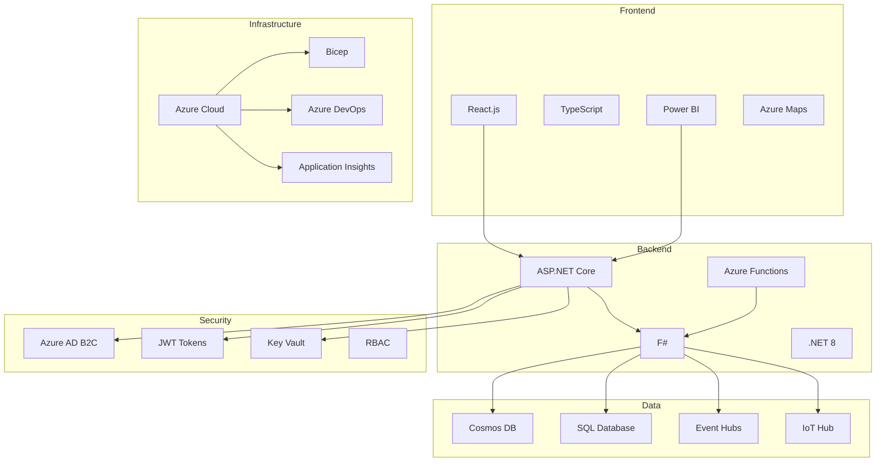

### **4.3 CI/CD Pipeline**

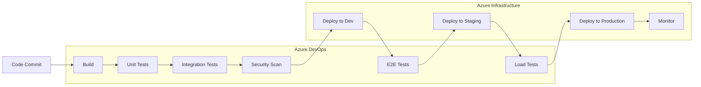

## **5. Use Case View**

### **5.1 Primary Use Cases**

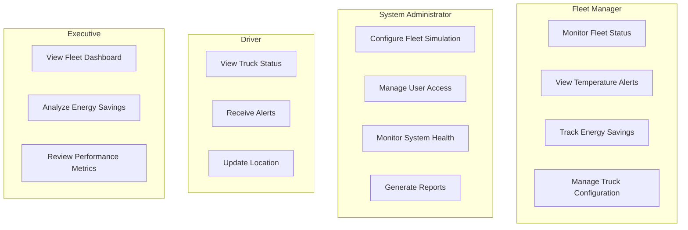

### **5.2 Use Case Details

#### **UC1: Monitor Fleet Status**
- **Actor**: Fleet Manager
- **Description**: View real-time status of all trucks in the fleet
- **Preconditions**: User is authenticated and authorized
- **Main Flow**:
  1. User accesses fleet dashboard
  2. System displays truck locations on map
  3. System shows truck status (In Transit, Loading, Maintenance)
  4. System updates data every 30 seconds
- **Postconditions**: User has current fleet status

#### **UC2: View Temperature Alerts**
- **Actor**: Fleet Manager
- **Description**: Receive and manage temperature excursion alerts
- **Preconditions**: Temperature anomaly detected
- **Main Flow**:
  1. System detects temperature excursion
  2. System generates alert with severity level
  3. System sends notification to fleet manager
  4. Fleet manager views alert details
  5. Fleet manager takes corrective action
- **Postconditions**: Alert is acknowledged and resolved

#### **UC3: Track Energy Savings**
- **Actor**: Fleet Manager
- **Description**: Monitor energy optimization results
- **Preconditions**: Fleet simulation is running
- **Main Flow**:
  1. System calculates baseline energy consumption
  2. System applies Cryox AI optimization
  3. System calculates energy savings
  4. System displays savings metrics
  5. Fleet manager reviews performance
- **Postconditions**: Energy savings are documented

## **6. Security Architecture**

### **6.1 Security Layers**

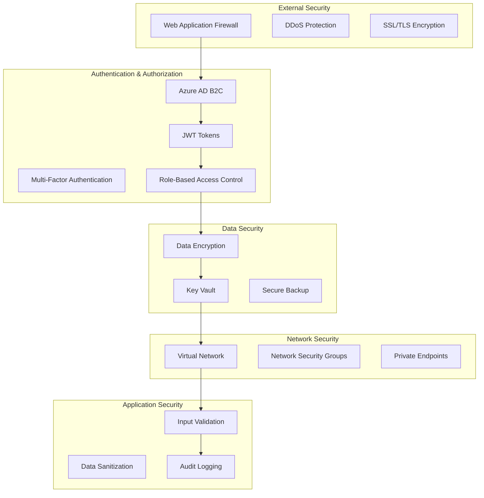

### **6.2 JWT Token Structure**

```json
{
  "header": {
    "alg": "RS256",
    "typ": "JWT",
    "kid": "key-id"
  },
  "payload": {
    "iss": "https://cryox.b2clogin.com/cryox.onmicrosoft.com/B2C_1_signupsignin/v2.0",
    "aud": "cryox-api",
    "exp": 1640995200,
    "iat": 1640908800,
    "sub": "user-id",
    "oid": "object-id",
    "given_name": "John",
    "family_name": "Doe",
    "email": "john.doe@company.com",
    "roles": ["FleetManager", "TemperatureViewer"],
    "facilities": ["warehouse-001", "warehouse-002"],
    "permissions": ["fleet:read", "temperature:read", "alerts:read"]
  },
  "signature": "signature"
}
```

### **6.3 Role-Based Access Control**

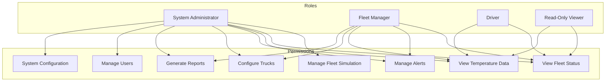

### **6.4 Security Implementation (F#)**

```fsharp
open System
open System.Security.Claims
open Microsoft.AspNetCore.Authentication.JwtBearer
open Microsoft.AspNetCore.Authorization
open Microsoft.AspNetCore.Mvc
open Microsoft.Extensions.Configuration
open Microsoft.IdentityModel.Tokens

// JWT Authentication Configuration
let configureJwtAuthentication (services: IServiceCollection) (configuration: IConfiguration) =
    services.AddAuthentication(JwtBearerDefaults.AuthenticationScheme)
        .AddJwtBearer(fun options ->
            options.Authority <- configuration.["AzureAdB2C:Authority"]
            options.Audience <- configuration.["AzureAdB2C:Audience"]
            options.TokenValidationParameters <- TokenValidationParameters(
                ValidateIssuer = true,
                ValidateAudience = true,
                ValidateLifetime = true,
                ValidateIssuerSigningKey = true,
                ClockSkew = TimeSpan.Zero
            )
        ) |> ignore

// Role-based Authorization
type FleetManagerRequirement() = 
    interface IAuthorizationRequirement

type FleetManagerHandler() =
    inherit AuthorizationHandler<FleetManagerRequirement>()
    
    override this.HandleRequirementAsync(context, requirement) =
        task {
            if context.User.HasClaim(ClaimTypes.Role, "FleetManager") then
                context.Succeed(requirement)
        }

// Secure API Controller
[<ApiController>]
[<Route("api/v1/fleet")>]
[<Authorize>]
type SecureFleetController(logger: ILogger<SecureFleetController>) =
    inherit ControllerBase()
    
    [<HttpGet("trucks")>]
    [<Authorize(Policy = "FleetManager")>]
    member this.GetFleetTrucks() =
        task {
            let userId = this.User.FindFirst(ClaimTypes.NameIdentifier)?.Value
            let userRoles = this.User.FindAll(ClaimTypes.Role) |> Seq.map (fun c -> c.Value)
            
            logger.LogInformation($"User {userId} with roles {String.Join(",", userRoles)} accessing fleet data")
            
            // Implement secure fleet data access
            return Ok("Fleet data")
        }
    
    [<HttpGet("alerts")>]
    [<Authorize(Policy = "TemperatureViewer")>]
    member this.GetAlerts() =
        task {
            // Implement secure alert access
            return Ok("Alert data")
        }

// Input Validation
type TemperatureReadingRequest = {
    TruckId: string
    Temperature: float
    Timestamp: DateTime
}

let validateTemperatureReading (request: TemperatureReadingRequest) =
    if String.IsNullOrEmpty(request.TruckId) then
        Error "TruckId is required"
    elif request.Temperature < -50.0 || request.Temperature > 50.0 then
        Error "Temperature must be between -50°C and 50°C"
    elif request.Timestamp > DateTime.UtcNow.AddMinutes(5) then
        Error "Timestamp cannot be in the future"
    else
        Ok request

// Audit Logging
type AuditService(logger: ILogger<AuditService>) =
    
    member this.LogFleetAccess(userId: string, action: string, resource: string) =
        logger.LogInformation($"AUDIT: User {userId} performed {action} on {resource} at {DateTime.UtcNow}")
    
    member this.LogTemperatureAlert(truckId: string, temperature: float, severity: string) =
        logger.LogWarning($"ALERT: Temperature excursion detected for truck {truckId}: {temperature}°C (Severity: {severity})")
    
    member this.LogEnergySavings(truckId: string, savings: float) =
        logger.LogInformation($"ENERGY: Truck {truckId} achieved {savings:F2}% energy savings")
```

## **7. Deployment Architecture**

### **7.1 Environment Strategy**

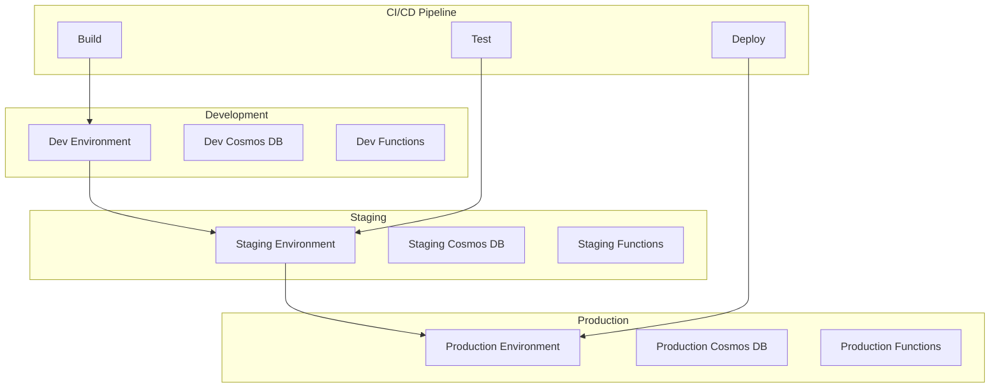

### **7.2 Infrastructure as Code (Bicep)**

```bicep
// main.bicep
param location string = resourceGroup().location
param environment string = 'dev'
param fleetSize int = 100

module iotHub 'modules/iot-hub.bicep' = {
  name: 'iot-hub-${environment}'
  params: {
    location: location
    environment: environment
    fleetSize: fleetSize
  }
}

module cosmosDb 'modules/cosmos-db.bicep' = {
  name: 'cosmos-db-${environment}'
  params: {
    location: location
    environment: environment
  }
}

module functions 'modules/functions.bicep' = {
  name: 'functions-${environment}'
  params: {
    location: location
    environment: environment
  }
}

module security 'modules/security.bicep' = {
  name: 'security-${environment}'
  params: {
    location: location
    environment: environment
  }
}
```

## **8. Monitoring & Observability**

### **8.1 Monitoring Strategy**

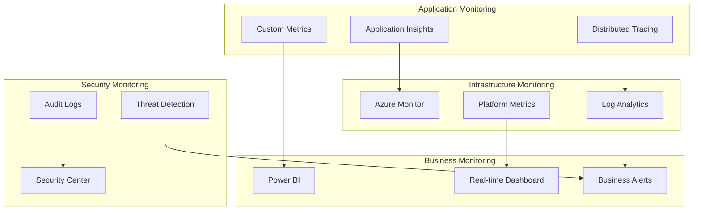

### **8.2 Key Performance Indicators**

| Category | Metric | Target | Alert Threshold |
|----------|--------|--------|-----------------|
| **Performance** | API Response Time | < 200ms | > 500ms |
| **Performance** | Function Execution Time | < 1s | > 5s |
| **Availability** | System Uptime | 99.9% | < 99% |
| **Scalability** | Message Throughput | 1000/min | < 800/min |
| **Business** | Anomaly Detection Rate | 95% | < 90% |
| **Business** | Energy Savings | 5-10% | < 3% |
| **Security** | Failed Login Attempts | < 10/hour | > 50/hour |
| **Security** | JWT Token Validation | 100% | < 95% |

## **9. Risk Assessment & Mitigation**

### **9.1 Technical Risks**

| Risk | Impact | Probability | Mitigation |
|------|--------|-------------|------------|
| **IoT Hub Throttling** | High | Medium | Implement retry logic, use multiple partitions |
| **Cosmos DB RU Exhaustion** | High | Medium | Auto-scaling, query optimization |
| **Function Cold Starts** | Medium | High | Premium plan, keep-warm functions |
| **Data Loss** | High | Low | Multi-region replication, backups |
| **Security Breach** | High | Low | Multi-layer security, regular audits |

### **9.2 Business Risks**

| Risk | Impact | Probability | Mitigation |
|------|--------|-------------|------------|
| **Simulation Inaccuracy** | Medium | Medium | Real data validation, expert review |
| **Performance Issues** | High | Low | Load testing, monitoring |
| **User Adoption** | High | Medium | User training, intuitive UI |
| **Scalability Limits** | High | Low | Cloud-native architecture |

## **10. Conclusion**

The 4+1 architecture view provides a comprehensive blueprint for the Cryox AI MVP, ensuring:

- **Scalability**: Cloud-native architecture supports 100+ trucks
- **Security**: Multi-layer security with JWT authentication and RBAC
- **Reliability**: High availability with monitoring and alerting
- **Maintainability**: Clean architecture with F# and proper separation of concerns
- **Observability**: Comprehensive monitoring and logging

This architecture establishes a solid foundation for the full production system while delivering immediate value through the fleet simulation MVP.
